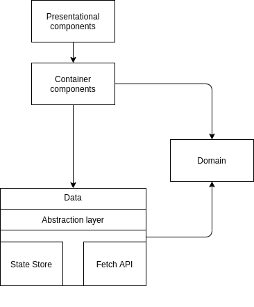

# Building blocks

The high level overview of the web-console can be seen in the following diagram:

The main blocks are the following:
- `View`: These consist of the React Components, whose responsibility is presenting 
the data to the users of the application, and subscribing to the appropriate data, that they need to present. 
We can differentiate two types of components here:

    - `Presentational components` are used for presenting data, 
    they have no relations to the rest of the system, their only responsibility is showing the data that they receive, 
    and provide an interface to react to the user actions. In the current scenario, 
    these are either the Patternfly components themselves, or some combination of them.
    
    - `Container components` are for example the pages, they tie together presentational components to a coherent view,
    and handle the integration with the rest of the system. They initiate a subscription at the Data layer, to receive
    specific Domain Entities
    
- `Domain`: It consists of the domain entities, that define what kind of data is the application dealing with.
The View needs to be able to present these entities, while the Data layer needs to be able to provide them.

- `Data`: The Data layer is responsible for handling communication with the backend, and data subscriptions from the View Layer.
There is an abstraction layer (`DataProvider`) that makes sure that the View layer doesn't need to know 
the internals of the Data Layer, for example how the Redux State Store is structured, 
or what library or method is used to fetch the data to the application. 
The Data layer provides a mechanism for providing Domain Entities to the rest of the application.

