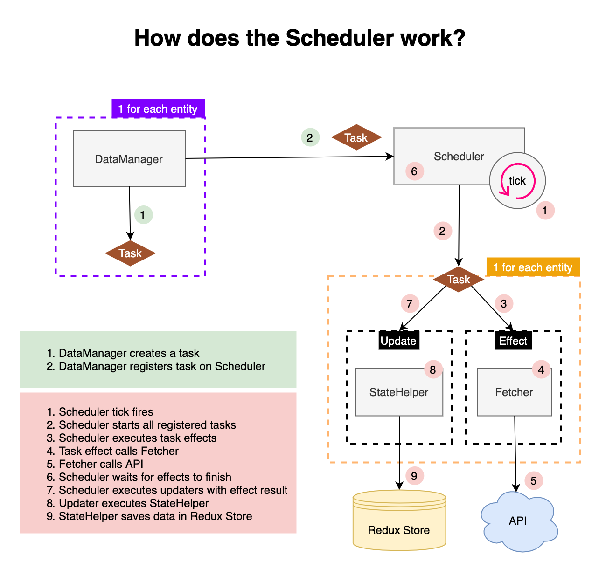

[Index](./index.md)

# Scheduler

The scheduler perform tasks indefinitely every 5 seconds.  
We use the scheduler to update data that is presented to the user.

## Task

A task contains an effect and an update.  
The effect fetches the data. And the update saves the effect result in the store.

## Why seperate effect & update

We first trigger the effects for all registered tasks.  
Once all the effects are finished, we execute all the updates with their effect result.  
This makes sure all data updates are done at the same time.  
And subsequently, the view is updated once with all the new data.  
When 1 effect takes a long time, all the other tasks have to wait for it to finish before the updates can be executed.

## How does it all work?

