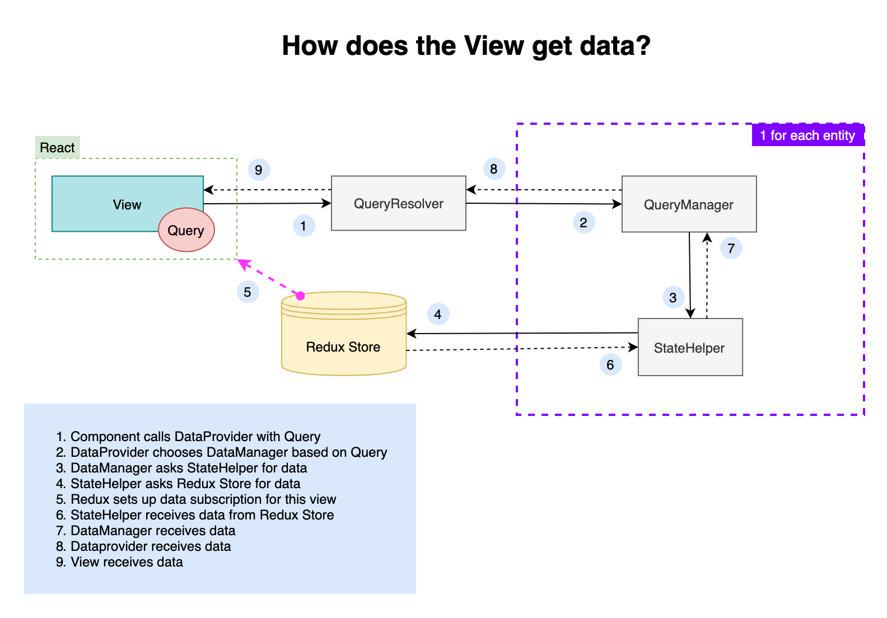

[Index](./index.md)

# View Data

## How does the view receive updated data?

For more information about how new data gets into the redux store, see [Scheduler](./scheduler.md).

During the application setup, a connection is made between `React` and `Redux`.  
This connection is responsible for rerendering components based on state changes in Redux.  
When a component does a query, a subscription is also setup.  
This component is now subscribed to a specific path in the Redux State.  
When data in this path changes, the component is rerendered.

This is why it's important that components subscribe to very specific paths.  
If they would subscribe to very general high level paths, that would cause a lot of unnecessary rerenders.

## Path

If we were fetching new instances for a specific service (with id `abc`), the path would be `store.serviceInstances.byId.abc`.  
The `Inventory` component will be subscribed to that specific path.  
So a change to that path will trigger a rerender for the `Inventory` component.

### Flow

1. Redux state change
2. The react-redux connection triggers all components for this specific state change (path)
3. Components do the query again
4. steps 1 - 9 are executed again (except for step 5)
