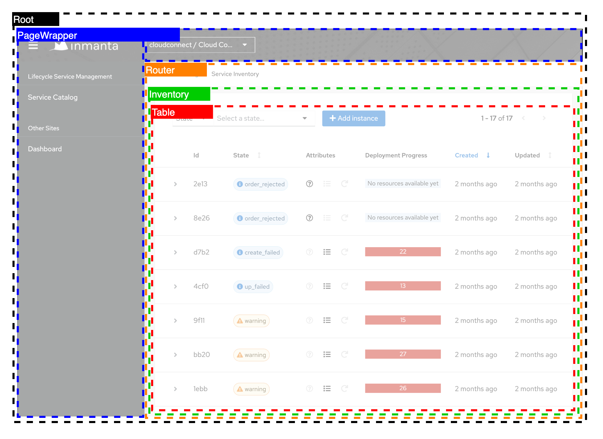
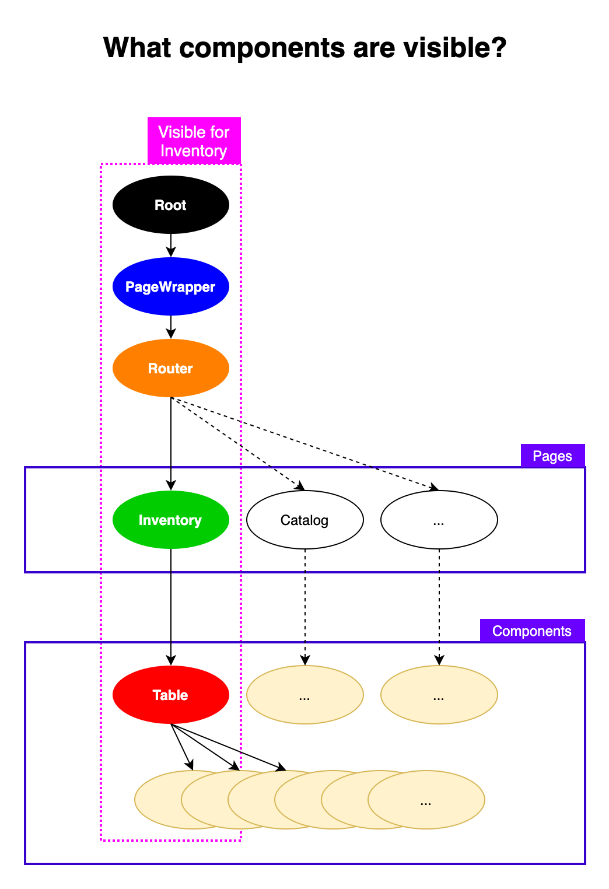

[Index](./index.md)

# View Structure

## Inventory

This example shows the high level components that are visible on the inventory page.



## Details

Top level components are always visible. They do not depend on a specific route / page.

```
Root -> PageWrapper -> Router
```

Next is the `Router`. The Router decides based on the url which page to show.  
The `Breadcrumbs` components also uses the url to show the required breadcrumbs.

```
Router -> InventoryPage
```

Next are page components. They are dependent on a specific route and render a specific page. (ex. Inventory)  
The page component functions as a `Provider` (not to be confused with `DataManager`).  
It's responsible for triggering the data layer and passing data down. It does not care about visualizing the data.  
Child components receive the data and visualize it.

```
InventoryPage -> Table -> Row -> Button
```


