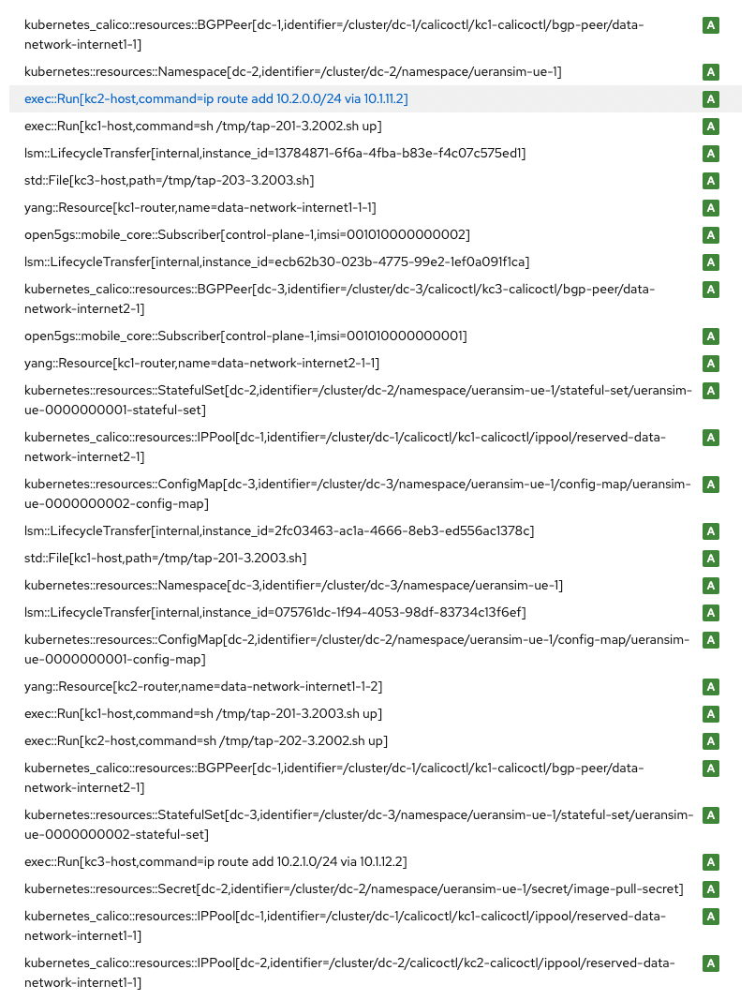

[Index](./index.md)

# Desired State Diff

## Selection

How does the user select 2 versions to compare?

This is a compare selection box next to the filters above all the versions.


On a version, click the actions dropdown and click "Select version for compare".


The selection box shows the selected version


On a different version, click the actions dropdown and click "Compare version against version".  
This will bring you to the compare page for those 2 versions.


If you select the already select version for compare, you get an unselect option.


## Libraries

- jsdiff
  - https://github.com/kpdecker/jsdiff
  - Text diffing in js
- react-diff-viewer
  - https://github.com/praneshr/react-diff-viewer
  - Works okay
  - Library does the diffing using jsdiff
  - Maybe a bit outdated or unmaintained
- jsdifflib
  - https://github.com/cemerick/jsdifflib
  - Outdated
- react-diff-view
  - https://github.com/otakustay/react-diff-view
  - Seems Very composable
  - We can use only what we need
  - Quite complex, needs some more testing
- react-gh-like-diff
  - https://github.com/neighborhood999/react-gh-like-diff
  - Based on Diff2Html
  - No activity on repo
  - outdated
- diff2html
  - https://github.com/rtfpessoa/diff2html
  - generate JSON or HTML based on unified diff
  - Seems pretty active
- parse-diff
  - https://github.com/sergeyt/parse-diff
  - parse a unified diff into some json structure

## Resource Overview

This is a summary of the changed resources.



This is useful to quickly see which resources were "Added", "Deleted" and "Modified".

- Fitting this overview next to the detail overview is difficult as the resource ids are quite long.
- Do we want to show this resource overview? We can just skip it for now and only show the detail overview. It contains all the information anyway.
- We could show the resource overview in a Patternfly drawer component. This way you can open it if you need it. But having both visible seems hard.

Github title example


Github file example


## Detail View

Built using `react-diff-viewer`.


For multiline values, we could push the entire diff to the next line making it full width.  
And by making the diff vertical instead of horizontal allows the value to stretch the full window width.

## Questions

- Showing unchanged attributes
  - Do we want to show unchanged attributes? Can this be useful?
  - We can initially hide unchanged attributes and add a toggle in the CardHeader or CardFooter.
- Do we show the attributes in alphabetic order?
  - When showing the unchanged attributes and values, do we show them on the bottom, or do we mix them in alphabetically?
- I think a split view (side by side) is the most useful, as we can just show the attribute name and then the old and new value.
  - Do we also want a "line by line" view?
- Do we want a review counter?
  - Like `0 / 11` resources checked
  - Each resource has a checkbox to signal you have viewed it. It will close. You can still open it.
  - And eventually you get `11 / 11`.

## Data Format

The amount of changed resources can be big, so we will need paging on this endpoint.  
On the frontend, it would be strange to have pages. So we will need to implement a "Load more" button at the end of the list.  
We will just grow the list on the frontend. On the backend, paging can be done like all other endpoints.

```json
{
  "data": [
    {
      "resource_id": "kubernetes_calico::resources::BGPPeer[dc-1,identifier=/cluster/dc-1/calicoctl/kc1-calicoctl/bgp-peer/data-network-internet1-1]", // string
      "type": "Modified", // "Added" | "Deleted" | "Modified"
      "attributes": [
        {
          "id": "purged", // string
          "type": "Modified", // "Modified" | "Unmodified"
          "diff": "--- \n+++ \n@@ -0,0 +1 @@\n+false", // unified diff
          "source": false, // old value
          "target": false // new value
        },
        {
          "id": "peer_ip", // string
          "type": "Unmodified", // "Modified" | "Unmodified"
          "diff": null, // unified diff
          "source": "10.255.136.9", // old value
          "target": "10.255.136.9" // new value
        }
      ]
    }
  ]
}
```

If we don't show unchanged attributes in the frontend, there is no point in having the type property on attributes ("Modified" | "Unmodified") as all of them are Modified.

The unified diff string should contain filenames.  
I am not sure if this is required for the official format.
But the `diff2html` library does not work without it.
Other libraries don't seem to care.

Does not work:

```
---
+++
@@ -0,0 +1 @@
+data-network-internet1-1
```

Works:

```
--- a
+++ a
@@ -0,0 +1 @@
+data-network-internet1-1
```

If we want a resource overview, and the data has pagination, then we need to get this list of resource ids somehow.  
Maybe a different endpoint?

## Diff Highlight

As far as I am aware, the unified diff format does not contain inline changes, only line changes.  
This means to highlight the actual change on a single line, the line has to be diffed in the frontend.

Example:

```
---
+++
@@ -1 +1 @@
-data-network-internet1-1
+data-network-internet1-2
```

There is only 1 character change, but the line is labeled as "Deleted" and "Added".  
Some frontend libraries do a diff and highlight the actual changed character.

## Conclusion

There are some libraries that seem useful. Some are quite outdated and unmaintained. Best to avoid those.  
Having the unified diff done on the backend seems the right approach. But some libraries do the diffing internally using another library.
And single line highlight is always done on the frontend.

The backend is responsible for listing the resources and their changes.  
The actual diff of 2 attributes can be done in the frontend.  
But the backend should provide a string representation of the attribute values.  
The layout and containers should always be built by us.  
For the actuall diff visual, we have 2 options:

### Option 1, build the visual ourselves

We have complete freedom to do what we want. But we might not need it.  
We can use `jsdiff` to generate a json structure describing the unchanged, deleted and added characters.

### Option 2, use a lib for generating the visual

We can use a component like `react-diff-viewer`. There are some options. But we will always be limited.  
We can use diff2html to generate a json structure of html. However, injecting html is kind of not done in React.
